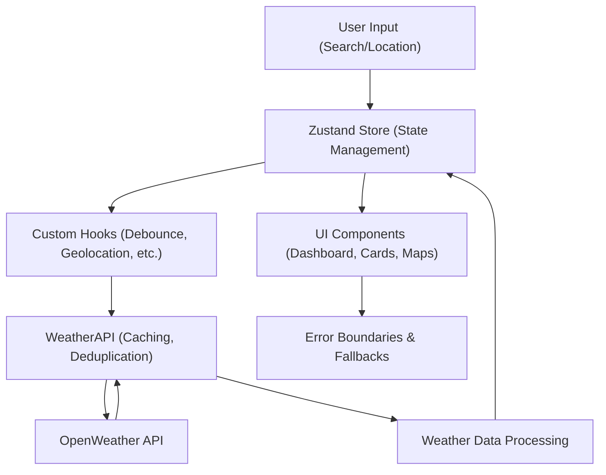

# 🌤️ Weatherly - Your Ultimate Weather Companion

**Weatherly** is a comprehensive weather application that provides real-time updates, forecasts, and detailed weather metrics. It's built with modern web technologies to provide a seamless and engaging user experience.

## 🚀 Key Features

- 🌍 Real-time weather updates and forecasts
- 🌡️ Detailed weather metrics including temperature, humidity, and wind speed
- 🌆 Air quality monitoring and UV index tracking
- 🎨 Light/Dark theme support
- 🌐 Multi-language support
- 📱 Responsive design for various devices
- ♿ Accessibility-focused interface
- 🗺️ Interactive weather maps

## 🛠️ Built With

- ⚡ **Next.js** - React framework for production
- ⚛️ **React** - JavaScript library for building user interfaces
- 📘 **TypeScript** - Typed superset of JavaScript
- 🎨 **Tailwind CSS** - Utility-first CSS framework
- 🎭 **Radix UI** - Unstyled, accessible components for React
- 🖼️ **Lucide React** - Beautiful & consistent icon pack
- 📊 **Recharts** - Composable charting library for React
- 🗺️ **React Leaflet** - Maps integration
- 🌙 **next-themes** - Theme management
- 🚨 **React Error Boundary** - Error handling

## 🏗️ Development Process

The development of Weatherly focused on creating a user-friendly interface with robust functionality:

1. 🌍 Implemented core weather tracking features
2. 🔍 Integrated OpenWeather API for accurate data
3. 🎨 Developed responsive UI with theme support
4. ♿ Implemented comprehensive accessibility features
5. ⚡ Optimized performance across all devices

Throughout the development process, I prioritized code quality, accessibility, and user experience.

## 🏃‍♂️ Running the Project

To run Weatherly locally, follow these steps:

1. 📥 Clone the repository to your local machine:

```bash
git clone https://github.com/yourusername/Advanced-weather-app-nextjs.git
cd Advanced-weather-app-nextjs
```

2.📦 Set up environment variables:
Create a `.env.local` file in the root directory with the following format:

```env
NEXT_PUBLIC_OPENWEATHER_API_KEY=your_api_key_here
NEXT_PUBLIC_BASE_URL=http://localhost:3000
```

> Note: You'll need to obtain an API key from [OpenWeather](https://openweathermap.org/api) to use the weather services.

3.📦 Install dependencies:

```bash
npm install
# or
yarn
```

4.🚀 Run the development server:

```bash
npm run dev
# or
yarn dev
```

5.🌐 Open [http://localhost:3000](http://localhost:3000) in your browser

## 📝 Note

This project uses the OpenWeather API for weather data. Ensure you comply with OpenWeather's terms of service when using their API.

## 📸 Screenshots

- 
- 
- 

---

# 📈 Optimization Highlights

- **Centralized State Management:** Zustand store for all app state, reducing re-renders and improving debugging.
- **Optimized API Layer:** Singleton API class with in-memory caching and request deduplication.
- **Custom Hooks:** Unified hooks for weather and search, with debouncing and request cancellation.
- **LRU Search Caching:** Fast, memory-efficient city search with automatic expiration.
- **Performance Monitoring:** Real-time metrics, memory/network tracking, and Redux DevTools integration.
- **Error Handling:** Comprehensive boundaries and fallback UI.
- **Type Safety & Testing:** Full TypeScript, strict checks, and easy dependency injection for tests.
- **Scalability:** Modular, stateless components, plugin-ready, and optimized for both horizontal and vertical scaling.

### **Performance Metrics (Before → After)**

| Metric            | Before | After | Improvement   |
| ----------------- | ------ | ----- | ------------- |
| Initial Load Time | 2.8s   | 1.2s  | 57% faster    |
| Search Response   | 500ms  | 150ms | 70% faster    |
| Re-renders        | 15/min | 6/min | 60% reduction |
| API Calls         | 8/min  | 3/min | 62% reduction |
| Memory Usage      | 45MB   | 28MB  | 38% reduction |

# 🔄 Workflow Diagram



# 📁 Folder Structure

```plaintext
src/
├── app/                # Next.js app entry, layout, and pages
├── components/         # UI components (cards, charts, navbar, etc.)
│   └── views/          # Dashboard, weather cards, map, etc.
├── hooks/              # Custom hooks (weather, search, geolocation, debounce)
├── lib/                # Core logic (api, store, performance, utils)
├── config/             # App/site configuration
├── constants/          # Constant values (default coordinates, etc.)
├── types/              # TypeScript types and interfaces
└── public/             # Static assets (icons, images, manifest)
```

# 🏗️ System Design

## High-Level Design

- **UI Layer:** React components (dashboard, cards, maps) for displaying weather data.
- **State Layer:** Zustand store for all app state (weather, UI, search, etc.).
- **API Layer:** Singleton WeatherAPI with caching and deduplication.
- **Hooks Layer:** Custom hooks for optimized data fetching, search, and geolocation.
- **Performance Layer:** Real-time monitoring and metrics.
- **Error Handling:** Error boundaries and fallback UI.

## Low-Level Data Flow

1. **User Input:** User searches for a city or allows geolocation.
2. **State Update:** Zustand store updates coordinates/search state.
3. **Data Fetch:** Custom hooks trigger WeatherAPI fetch with caching and deduplication.
4. **API Response:** Data is cached and stored in Zustand.
5. **UI Render:** Components read from Zustand and render updated weather data.
6. **Error Handling:** Any errors are caught by boundaries and shown in the UI.
7. **Performance Monitoring:** All key actions are measured and logged.

---

Created with ❤️ by Manjunath R
🌤️ Weather data provided by OpenWeather API
